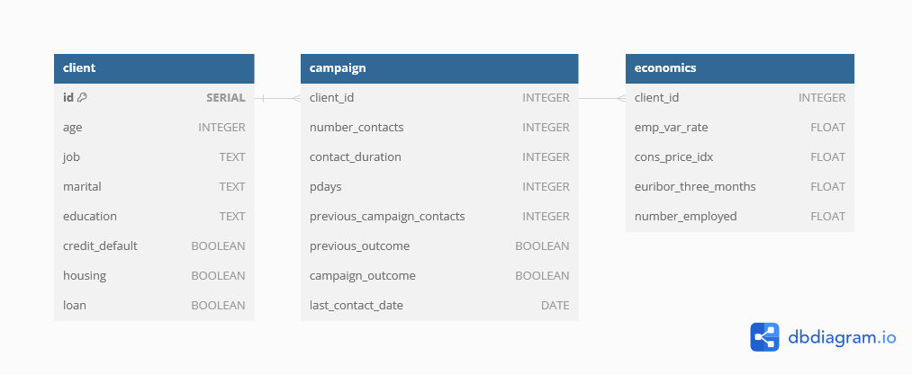

# ETL Bank Marketing Dataset

This project utilizes the Bank Marketing dataset from UC Irvine, sourced from [UCI Machine Learning Repository - Bank Marketing](https://archive.ics.uci.edu/dataset/222/bank+marketing).

## Project Overview

Applying ETL (Extract, Transform, Load) with PySpark to clean and preprocess raw data and store into a PostgreSQL database. Designing appropriate table structures based on different attributes and data types, dividing the data into three distinct tables: client, campaign, and economics.

## File Description
- create_database.sql:  Create the database.
- create_tables.sql:  Create client, campaign, economics tables.
- data_cleaning.ipynb:  Data cleaning with PySpark.
- database_import.ipynb:  Import the cleaned data into the database.
- sql_query.ipynb: Test SQL query command.

## ER Diagram

## License

"Bank Marketing" dataset (c) by S. Moro, P. Rita, P. Cortez - UCI Machine Learning Repository.
